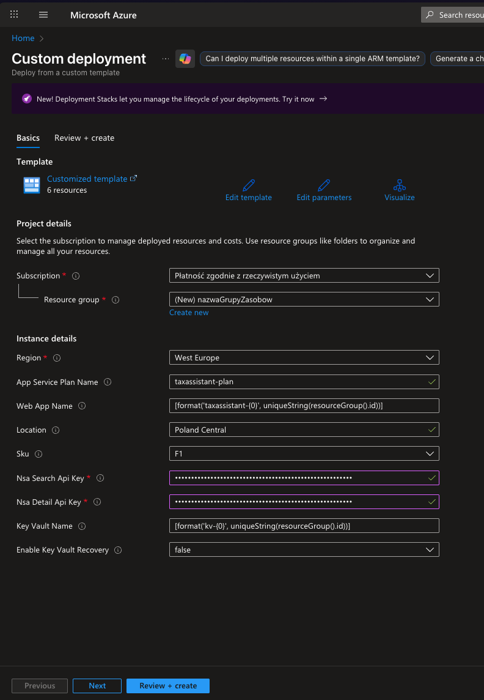
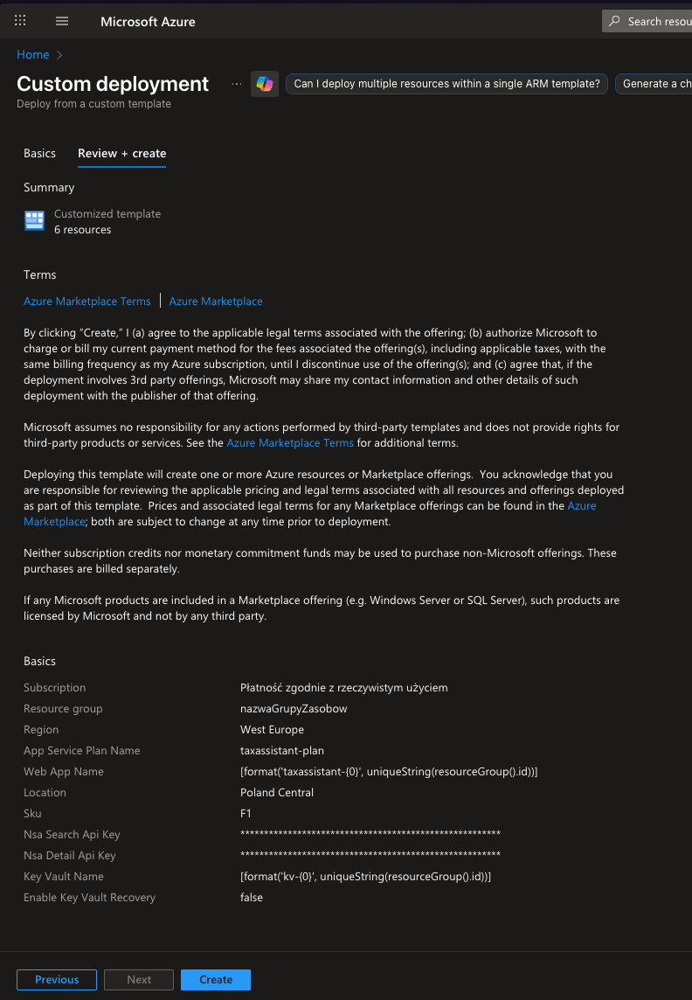
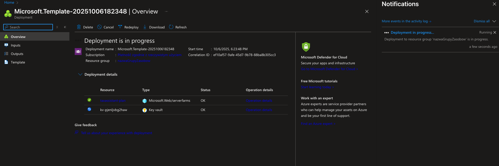
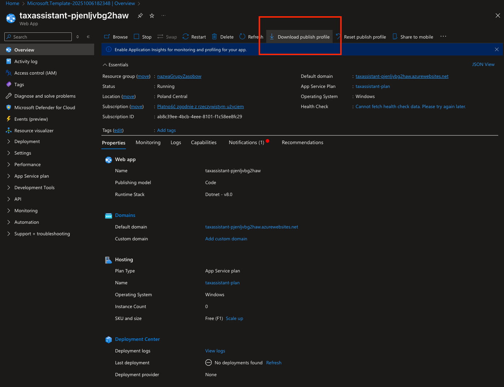

# 🚀 TaxAssistantApp - Uproszczone Wdrożenie

Proces wdrożenia TaxAssistantApp w Azure.

[//]: # (Wdróż aplikację TaxAssistantApp w swojej subskrypcji Azure za pomocą prostego procesu jednym kliknięciem. To wdrożenie tworzy tylko niezbędną infrastrukturę &#40;App Service + Key Vault&#41; bez skomplikowanych integracji.)

## ✨ Co zostanie wdrożone

- **Azure App Service** - Hostuje twoją aplikację webową
- **Azure Key Vault** - Bezpiecznie przechowuje klucze API
- **Managed Identity** - Umożliwia aplikacji bezpieczny dostęp do Key Vault

## 📋 Wymagania wstępne

Przed wdrożeniem będziesz potrzebować:

1. **Subskrypcję Azure** - Z uprawnieniami do tworzenia zasobów
2. **Klucz API NSA Search** - Do funkcji wyszukiwania interpretacji podatkowych
3. **Klucz API NSA Detail** - Do pobierania szczegółowych interpretacji

## 🎯 Proces Wdrożenia

### Krok 1: Kliknij Deploy to Azure

[](https://portal.azure.com/#create/Microsoft.Template/uri/https%3A%2F%2Fraw.githubusercontent.com%2F19bartek92%2FtaxAssistantApp-deployment%2Fmain%2Fazuredeploy.json)

[//]: # ()
[//]: # (*[Placeholder zrzutu ekranu: Przycisk Deploy to Azure]*)

### Krok 2: Zaloguj się do Azure

Zostaniesz przekierowany do Azure Portal, aby uwierzytelnić się swoim kontem Azure.


### Krok 3: Skonfiguruj Parametry Wdrożenia

Wypełnij formularz wdrożenia swoimi ustawieniami:

| Parametr | Opis | Wartość Domyślna / Opcje | Przykład | Wymagane |
|----------|-----|-------------------------|----------|----------|
| **Subscription** | Twoja subskrypcja Azure | *(wybierz z listy)* | `Moja Subskrypcja Firmowa` | ✅ |
| **Resource Group** | Utwórz nową lub użyj istniejącej | *(utwórz nową)* | `rg-taxassistant-prod` | ✅ |
| **Region** | Region Azure do wdrożenia | **Poland Central** *(domyślna)*<br/>*Inne: West Europe, North Europe* | `Poland Central` | ✅ |
| **App Service Plan Name** | Nazwa planu hostingowego | **taxassistant-plan** *(domyślna)* | `plan-taxassistant-firma` | ✅ |
| **Web App Name** | Nazwa twojej aplikacji<br/>*⚠️ Musi być globalnie unikalna* | **taxassistant-{unikalnyCiąg}** *(auto)*<br/>*Tylko litery, cyfry, myślniki* | `taxassistant-abc123`<br/>`taxassistant-mojafirma` | ✅ |
| **SKU** | Rozmiar planu hostingowego | **F1** *(darmowa, domyślna)*<br/>*Opcje: F1, B1, B2, S1, S2, P1v3, P2v3* | `F1` dla testów<br/>`S1` dla produkcji | ✅ |
| **NSA Search API Key** | Twój klucz API do wyszukiwania<br/>*🔒 Będzie bezpiecznie przechowany* | *(brak domyślnej - wprowadź swój)* | `abcd1234-ef56-7890-...` | ✅ |
| **NSA Detail API Key** | Twój klucz API do szczegółów<br/>*🔒 Będzie bezpiecznie przechowany* | *(brak domyślnej - wprowadź swój)* | `wxyz9876-ab12-3456-...` | ✅ |
| **Key Vault Name** | Nazwa dla bezpiecznego magazynu<br/>*⚠️ Musi być globalnie unikalna* | **kv-{unikalnyCiąg}** *(auto)*<br/>*3-24 znaki, tylko litery i cyfry* | `kv-abc123`<br/>`kv-taxassistant-prod` | ✅ |
| **Enable Key Vault Recovery** | Odzyskiwanie usuniętego Key Vault | **false** *(domyślna)*<br/>*true - jeśli wcześniej usunąłeś KV* | `false` | ❌ |

#### 💡 Porady dotyczące wypełniania:

**🎯 Nazwy unikalne (Web App, Key Vault):**
- System automatycznie wygeneruje unikalne ciągi
- Możesz zmienić na własne, ale sprawdź dostępność
- Używaj tylko: litery, cyfry, myślniki (bez spacji, polskich znaków)

**💰 Wybór SKU:**
- **F1 (Free)** - Do testów, ograniczenia: 60min/dzień, 1GB
- **B1/B2 (Basic)** - Małe aplikacje produkcyjne, ~€10-20/mies
- **S1/S2 (Standard)** - Średnie aplikacje, ~€55-110/mies
- **P1v3+ (Premium)** - Duże aplikacje, zaawansowane funkcje

**🔑 Klucze API NSA:**
- Upewnij się, że masz poprawne klucze przed wdrożeniem
- Klucze będą bezpiecznie zaszyfrowane w Key Vault
- Nie będą widoczne w logach ani interfejsie Azure

[//]: # (*[Placeholder zrzutu ekranu: Formularz wdrożenia z wypełnionymi parametrami]*)

### Krok 4: Przejrzyj i Utwórz

1. Zaznacz "Akceptuję warunki i zasady wymienione powyżej"
2. Kliknij **"Review + create"**
3. Przejrzyj swoje ustawienia
4. Kliknij **"Create"**

[//]: # (*[Placeholder zrzutu ekranu: Ekran przeglądu i tworzenia]*)


### Krok 5: Poczekaj na Wdrożenie

Wdrożenie zazwyczaj trwa 3-5 minut. Zobaczysz ekran postępu.




[//]: # (*[Placeholder zrzutu ekranu: Wdrożenie w toku]*)

### Krok 6: Wdrożenie Zakończone

Po zakończeniu zobaczysz komunikat o sukcesie z wynikami wdrożenia.


[//]: # (*[Placeholder zrzutu ekranu: Wdrożenie zakończone z rezultatami]*)

## 📥 Pobierz Profil Publikacji

Po zakończeniu wdrożenia musisz pobrać profil publikacji, aby wysłać go do developera:

1. Przejdź do **Azure Portal** → **App Services**
2. Znajdź i kliknij na swoją wdrożoną aplikację (np. `taxassistant-abc123`)
3. W sekcji **Overview**, kliknij **"Download publish profile"**
4. Zapisz plik `.pubxml`



[//]: # (*[Placeholder zrzutu ekranu: Przegląd App Service z podświetlonym przyciskiem pobierania]*)


## 🌐 Dostęp do Twojej Aplikacji

Po wdrożeniu kodu przez developera, twoja aplikacja będzie dostępna pod adresem:
```
https://[nazwa-twojej-aplikacji].azurewebsites.net
```

## ❓ Rozwiązywanie Problemów

### Częste Problemy

**P: Wdrożenie kończy się niepowodzeniem z "Key Vault name not available"**
O: Nazwy Key Vault muszą być globalnie unikalne. Spróbuj innej nazwy lub pozwól systemowi wygenerować jedną.

[//]: # (**P: Nie mogę pobrać profilu publikacji**)

[//]: # (O: Warstwa F1 &#40;darmowa&#41; ma ograniczone opcje publikacji. Nadal możesz wdrażać używając Visual Studio Code z rozszerzeniem Azure lub Azure CLI z centrum wdrożenia.)

**P: Aplikacja pokazuje błąd po wdrożeniu**
O: Infrastruktura została utworzona, ale kod aplikacji musi zostać wdrożony przez developera.

**P: Klucze API nie działają**
O: Sprawdź dwukrotnie, czy wprowadziłeś poprawne klucze API NSA podczas wdrożenia.

[//]: # (### Uzyskiwanie Pomocy)

[//]: # ()
[//]: # (Jeśli napotkasz problemy:)

[//]: # ()
[//]: # (1. Sprawdź Azure Portal → Resource Group → Deployments dla szczegółów błędu)

[//]: # (2. Skontaktuj się ze swoim developerem z komunikatem błędu)

[//]: # (3. Upewnij się, że wszystkie wymagane parametry zostały wypełnione poprawnie)

## 🔒 Notatki Bezpieczeństwa

- Klucze API są bezpiecznie przechowywane w Azure Key Vault
- Aplikacja używa Managed Identity do dostępu do sekretów
- Wszystkie połączenia używają HTTPS
- Profil publikacji zawiera tymczasowe dane uwierzytelniające wdrożenia

## 💰 Szacowanie Kosztów

Szacowany miesięczny koszt dla planu F1 w Polsce Centralnej:
- **App Service Plan (F1)**: DARMOWY (z ograniczeniami)
- **Key Vault**: ~2 zł/miesiąc (za operacje na sekretach)
- **Razem**: ~2 zł/miesiąc

*Ograniczenia F1: 60 minut czasu obliczeniowego dziennie, 1GB miejsca na dysku, brak domen niestandardowych*

*Uwaga: Koszty mogą się różnić w zależności od regionu i użycia. Sprawdź kalkulator cen Azure dla dokładnych szacunków.*

---

[//]: # (## 📞 Wsparcie)

[//]: # ()
[//]: # (W przypadku wsparcia technicznego lub pytań dotyczących tego procesu wdrożenia, skontaktuj się ze swoim zespołem deweloperskim.)

**Miłego wdrażania!** 🎉